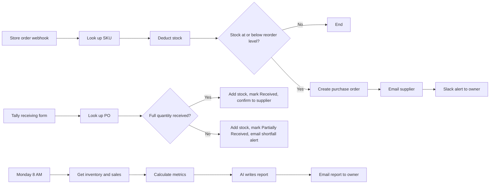

# Smart Inventory Manager

Automated inventory management for e-commerce brands, built in **n8n**.

It updates stock after every order, detects low-stock products, creates purchase orders, emails suppliers, logs deliveries, and sends the owner a weekly AI-written inventory report.

> Built as a portfolio project and tested with simulated store orders.


---

## The problem

Small online stores often track stock by hand. That leads to:

- Stockouts and lost sales
- Manual inventory checking
- Late supplier reordering
- Overselling from outdated stock numbers
- Slow-moving and excess inventory
- Purchase orders written by hand

## What it does

| Flow | Trigger | What happens |
|---|---|---|
| **1. Order → Purchase Order** | Store order (webhook) | Looks up the SKU, deducts stock, and if stock is at or below the reorder level, creates a purchase order, emails the supplier, and alerts the owner on Slack |
| **2. Stock Receiving** | Tally form submitted by staff | Finds the purchase order, adds the delivered quantity to stock, and marks the PO `Received` or `Partially Received`. Short deliveries trigger an alert email to the supplier showing the shortfall |
| **3. Weekly Inventory Report** | Every Monday, 8 AM | Pulls inventory and sales data, calculates metrics, has an AI model write a plain-English report, and emails it to the owner |

## How it works



### Design decision: rules vs. AI

The stock check is a plain **IF node** (stock ≤ reorder level), and the weekly metrics are calculated in a **Code node**. Fixed rules give the same correct answer every time. The AI model only writes the report from numbers that were already calculated.

## Tech stack

| Component | Tool |
|---|---|
| Automation engine | n8n |
| Database | Google Sheets |
| Order input | Webhook (simulated Shopify orders) |
| Stock receiving form | Tally |
| Supplier email | Gmail |
| Owner alerts | Slack |
| AI report | Groq |

## Data model (Google Sheets)

**Inventory**

| SKU | Product | Stock | Reorder Level | Reorder Qty | Supplier | Supplier Email | Unit Cost |
|---|---|---|---|---|---|---|---|

**Purchase Orders**

| PO Number | Date | Supplier | SKU | Product | Qty Ordered | Qty Received | Status |
|---|---|---|---|---|---|---|---|

Status values: `Ordered`, `Partially Received`, `Received`.

**Sales History**

| Date | Order ID | SKU | Qty |
|---|---|---|---|

Sample data for all three tabs is in [`/sample-data`](sample-data).

## Weekly report metrics

Calculated in code from the last 14 days of sales:

- Low-stock products
- Best sellers
- Products likely to run out soon (days of stock left)
- Slow-moving products
- Overstocked products

## Setup

1. **Import the workflow.** In n8n, open the menu and choose *Import from file*, then select `workflows/smart-inventory-manager.json`.
2. **Create the Google Sheet** with the three tabs above, using the headers exactly as written. Import the files in `/sample-data`.
3. **Add credentials** in n8n: Google Sheets, Gmail, Slack, Groq.
4. **Point each Google Sheets node** at your spreadsheet.
5. **Set the timezone** in the workflow settings.
6. **Create the Tally receiving form** with the fields *PO Number*, *SKU* and *Quantity Received*, and connect it to the Tally trigger.
7. **While testing, replace supplier emails** with your own address.
8. **Activate** the workflow.

## Testing

Send a simulated order to the webhook (Postman, Hoppscotch or curl):

```json
{"order_id": "ORD-1042", "sku": "NAM-42", "quantity": 2}
```

| Test | Expected result |
|---|---|
| Order drops stock below the reorder level | Stock updates, PO created, supplier emailed, Slack alert sent |
| Order leaves stock above the level | Stock updates, nothing else happens |
| Order lands exactly on the reorder level | PO is created (tests "at or below") |
| Full delivery submitted on the form | Stock increases, PO marked `Received` |
| Short delivery submitted on the form | Stock increases, PO marked `Partially Received`, shortfall email sent |
| Monday 8 AM schedule (or manual execute) | Weekly report emailed |

## Challenges and lessons

- **`NaN` in calculations.** Formulas were pointing at fields the previous node no longer passed on. Fix: reference the lookup node directly and test each value in a temporary field.
- **Expression syntax.** One mismatched bracket broke an entire email template. Every opener needs its own closer.
- **Testing without a store.** I had no Shopify store, so I learned to send simulated orders to my own webhook with Postman.
- **Short deliveries.** Handling partial receipts (and accumulating received quantity across several deliveries) took more design than the rest of the receiving flow.

## Roadmap

- Connect a real Shopify store in place of the simulated webhook
- Move from Google Sheets to a proper database
- Generate purchase orders as PDF documents saved to Google Drive
- Add error branches for unknown SKU, out-of-stock orders, duplicate orders, and unknown purchase orders

## Repository structure

```
smart-inventory-manager/
├── README.md
├── workflows/
│   └── smart-inventory-manager.json
├── sample-data/
│   ├── inventory.csv
│   ├── purchase-orders.csv
│   └── sales-history.csv
└── images/
    └── workflow-overview.png
```

## Security note

Before committing the exported workflow JSON, check that it contains **no credentials, API keys, webhook URLs or real email addresses**.

## Author

**Kenny** (Omisore Kehinde) — workflow and operations automation.

[LinkedIn](https://www.linkedin.com/) · [X](https://x.com/)
